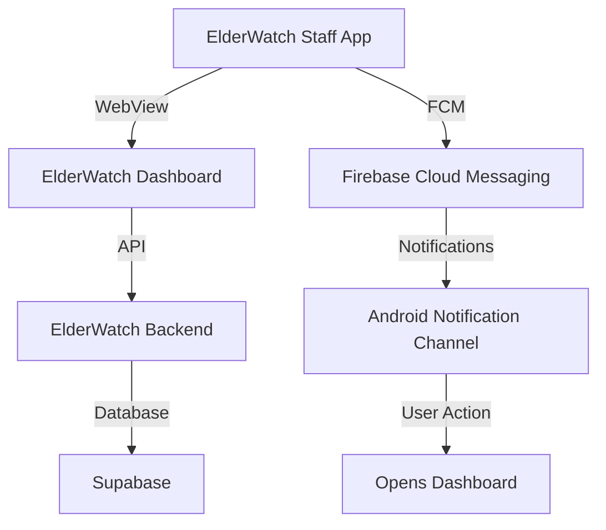

#[ElderWatch Logo](https://elderwatch-new.vercel.app/logo.png) ElderWatch Staff App
*A native Android (Kotlin) wrapper for ElderWatch dashboard with Firebase Cloud Messaging integration*

[](https://github.com/a77lic7ion/ElderWatch-Staff-APK)
[](https://kotlinlang.org/)
[%20-blue.svg)](https://developer.android.com/about/versions/nougat/android-7.0-changelog)
[%20-blue.svg)](https://developer.android.com/about/versions/14)
[](https://github.com/a77lic7ion/ElderWatch-Staff-APK/actions)
[](https://elderwatch-new.vercel.app/downloads/ElderWatch-Staff.apk)
[](https://elderwatch-new.vercel.app/admin)

---

## 📌 **Core Features**
- **Live Resident Dashboard**: Real-time monitoring of residents via WebView
- **Instant Help Alerts**: Firebase Cloud Messaging (FCM) notifications when residents tap "I need help"
- **Role-Based Access**: Server-controlled permissions (home-specific, group, or global)
- **Session Persistence**: Uses `localStorage` to maintain authentication across app restarts
- **Native Integration**: Handles OS-level links (WhatsApp, calls, emails) and notification permissions

---

## 🔧 **Technical Architecture**


### **Key Components**
1. **WebView Wrapper**
   - Embeds the ElderWatch dashboard (`https://elderwatch-new.vercel.app/admin`)
   - Intercepts non-web links (e.g., `whatsapp://`, `tel:`) and routes them to native apps
   - Prioritizes **WhatsApp Business** over standard WhatsApp for consistency

2. **Firebase Cloud Messaging (FCM)**
   - Delivers **single-notification alerts** (replaces previous alerts via shared tag)
   - Alerts are **home-specific** (only staff assigned to the requesting home receive notifications)
   - Global admins are **excluded** to avoid alert fatigue

3. **Session Management**
   - Uses `localStorage` (not `sessionStorage`) to persist authentication
   - Explicit `commit()` calls ensure session data is written to disk before app termination

---

## 🚀 **How It Works**
### **1. Authentication Flow**
1. Staff opens the app → WebView loads the ElderWatch dashboard.
2. Staff signs in with their credentials → Session stored in `localStorage`.
3. **App remains signed in** even after closure (via `localStorage` persistence).

### **2. Alert Mechanism**
1. Resident taps **"I need help"** → Server triggers FCM payload.
2. **Single notification** replaces previous alerts (shared tag: `elderwatch_help_alert`).
3. Notification opens the dashboard → Resident’s card is **pre-highlighted** (red).

### **3. Access Control**
| **Role**               | **Visibility**                          | **Alerts**                          |
|------------------------|----------------------------------------|-------------------------------------|
| Care Staff / Home Admin | Only their home’s residents            | Yes (home-specific)                 |
| Group Manager          | Assigned homes only                    | Yes (home-specific)                 |
| Global Admin           | All homes                              | **No** (excluded to avoid spam)     |

---

## ⚠️ **WebView Quirks & Fixes**
| **Issue**                          | **Solution**                                                                 |
|-------------------------------------|------------------------------------------------------------------------------|
| Non-web links (`whatsapp://`, `tel:`) | Intercepted and routed to native apps (falls back to `com.whatsapp` if missing). |
| WhatsApp Business priority          | Checks for `com.whatsapp.w4b` before `com.whatsapp`.                          |
| Session loss on app close           | Uses `localStorage` (not `sessionStorage`).                                  |
| Notification permission (Android 13+) | Explicitly requested at runtime.                                           |
| APK signing                        | Must match previous TWA build (`versionCode > 12`).                           |

---

## 🔐 **Configuration**
### **Required Files (Untracked)**
Place these in the project root (never commit secrets):
```properties
# secrets.properties (public key only)
SUPABASE_URL=https://<project>.supabase.co
SUPABASE_ANON_KEY=<public_anon_key>

# keystore.properties (critical for updates)
storeFile=/absolute/path/to/elderwatch4.jks
storePassword=********
keyAlias=<alias>
keyPassword=********
```

### **Critical Notes**
- **Keystore must remain unchanged** → Ensures seamless updates (no forced re-login).
- **`versionCode` > 12** → Maintains compatibility with the previous TWA build.
- **Supabase anon key is public** → Permissions are server-side; this key is also used in the web app.

---

## 🛠️ **Build & Installation**
### **Prerequisites**
- JDK 17 (pinned in `gradle.properties`; AGP 8.5 does **not** support JDK 26).
- Android SDK 24+ (target SDK 34).

### **Steps**
1. **Build the APK**:
   ```bash
   ./gradlew assembleRelease
   ```
2. **Verify signing**:
   ```bash
   aapt2 dump badging app/build/outputs/apk/release/app-release.apk | grep package:
   apksigner verify --print-certs app-release.apk | grep SHA-256
   ```
   - **Output must match** the previous build’s SHA-256 fingerprint.

3. **Install manually** (for testing):
   ```bash
   adb install -r app/build/outputs/apk/release/app-release.apk
   ```

---

## 📤 **Releasing Updates**
1. **Increment `versionCode`** in `app/build.gradle.kts` (e.g., `19` → `20`).
2. **Rebuild**:
   ```bash
   ./gradlew assembleRelease
   ```
3. **Update the web repo**:
   - Copy `app-release.apk` to `public/downloads/ElderWatch-Staff.apk`.
   - Commit and push → Vercel auto-deploys the new APK.
4. **Notify staff** → Users can install over the old APK (no re-login required).

---

## ⚠️ **Gotchas & Best Practices**
1. **Device Coverage Check**
   - **Every home must have at least one signed-in staff device** → Otherwise, alerts fail silently.
   - Verify via the dashboard: `All Homes` → Check for homes with `0` assigned staff.

2. **Session Management**
   - Clearing app data **signs out staff** and stops alerts until re-login.
   - Use `adb shell pm clear com.elderwatch.launcher` to test.

3. **Alert Filtering**
   - **The app trusts the server** → Bugs in recipient rules **cannot** be bypassed on-device.

4. **Android 13+ Permissions**
   - Explicitly request `NOTIFICATION` permission in `AndroidManifest.xml`:
     ```xml
     <uses-permission android:name="android.permission.POST_NOTIFICATIONS" />
     ```

---

## 🤝 **Contributing**
### **Development Workflow**
1. **Fork the repo** and clone locally.
2. **Set up dependencies**:
   ```bash
   ./gradlew dependencies
   ```
3. **Test changes** in a debug build:
   ```bash
   ./gradlew installDebug
   ```
4. **Submit a PR** with:
   - Clear description of changes.
   - Updated `CHANGELOG.md` (if applicable).
   - Verification that `versionCode` increments appropriately.

### **Code Style**
- Follow **Kotlin Kotlin Style Guide**.
- Use **Android Architecture Components** where applicable.
- **No hardcoded secrets** → Always use `secrets.properties` for environment-specific values.

---

## 📄 **License**
This project is **unlicensed** (public domain). However, the underlying ElderWatch system has proprietary restrictions. See the [ElderWatch web README](https://github.com/elderwatch/elderwatch-web) for legal terms.